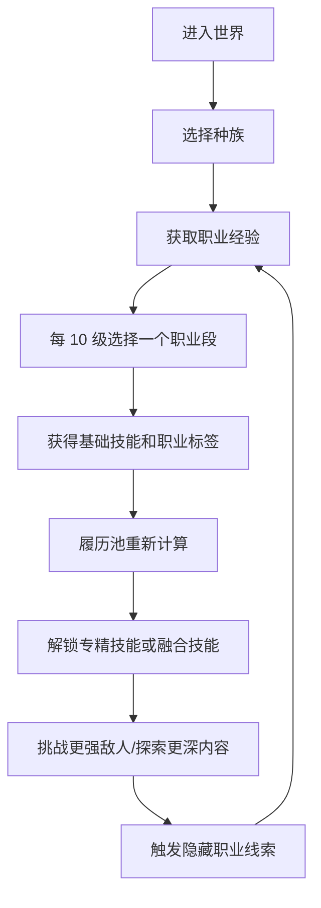

# MC Mod 产品设计：职业履历融合

暂定名：职业履历 / Career Chronicle  
文档版本：v0.1  
日期：2026-06-01  
定位：Minecraft RPG 成长类 Mod，主打“种族选择 + 每 10 级职业履历 + 无序职业融合技能 + 隐藏职业解锁”。

## 1. 一句话定位

玩家进入世界时选择种族，之后每 10 个职业等级选择一次职业；所有选择都会永久进入“职业履历池”，职业之间按组合解锁融合技能。专精同一职业会获得更强的深度能力，混合不同职业会获得新的玩法形态，隐藏职业通过世界行为、战斗成就和特殊仪式解锁。

核心卖点不是“有职业”，而是：

> 你的每一段职业履历都会参与构筑，最终形成独一套职业组合。

## 2. 产品判断

### 2.1 为什么这个方向可以做

现有 Minecraft RPG Mod 大多分为几类：

- 开局身份类：例如种族、起源、天赋，特点是开局选择强，但长期成长弱。
- 技能树类：特点是成长清晰，但职业幻想弱，容易变成点数加成。
- MMO 熟练度类：特点是内容覆盖广，但通常更偏工具和数值限制。
- 职业包类：特点是技能表现强，但经常是单职业路线，组合构筑不足。

本 Mod 的机会点是“职业履历融合”：

- 玩家不是只选一个职业，而是在一生中不断留下职业段落。
- 技能不是只由当前职业决定，而是由职业履历池共同决定。
- 相同职业组合的最终融合结果一致，顺序只影响何时成型。
- 种族、隐藏职业、职业重复次数共同制造长期目标。

### 2.2 主要风险

最大风险不是技术实现，而是组合规模失控。

如果每两个职业、每三个职业都手写独立技能，会迅速变成无法平衡、无法维护的内容黑洞。因此本设计采用：

- 职业提供标签。
- 履历池统计职业次数和标签强度。
- 融合技能按规则解锁。
- 特殊职业只在少量关键节点手写。

## 3. 设计原则

### 3.1 组合一致原则

职业履历的结算是无序的。

例如：

```text
火魔法师 -> 弓箭手
弓箭手 -> 火魔法师
```

两者在拥有 `火魔法师 x1 + 弓箭手 x1` 时，都应解锁同一个融合技能：火焰箭。

顺序可以影响：

- 玩家什么时候解锁该技能。
- 前 10 级到 20 级的过渡体验。
- 当前阶段哪些基础技能成长更快。
- UI 如何提示下一次选择的收益。

顺序不应该影响：

- 同一履历组合的最终融合技能。
- 同一组合的核心职业身份。

### 3.2 专精与混职都必须有价值

专精同职业获得更强的深度能力：

```text
火魔法师 x1：火球
火魔法师 x2：火焰爆裂
火魔法师 x3：燃烧掌控
火魔法师 x4：炎狱领域
```

混合不同职业获得新玩法：

```text
火魔法师 x1 + 弓箭手 x1：火焰箭
火魔法师 x1 + 战士 x1：烈焰斩
火魔法师 x1 + 盗贼 x1：燃影突袭
```

进一步区分：

```text
火魔法师 x2 + 弓箭手 x1：爆裂火箭
火魔法师 x1 + 弓箭手 x2：精准燃烧箭
```

两者仍来自同一组合逻辑，但偏向不同。

### 3.3 种族决定边界，不决定唯一答案

种族应该影响路线，但不应该让玩家一开局就掉进“错误答案”。

种族可以决定：

- 初始属性。
- 天生标签。
- 职业选择限制。
- 隐藏职业条件。
- 某些技能的额外效果。

种族不应该导致：

- 某个职业完全不可玩，除非这是明确的幻想设定。
- 玩家不知道后果就被永久惩罚。
- 多人服务器中出现无法接受的强弱差距。

### 3.4 数据驱动优先

职业、种族、技能、融合规则都应尽量由 JSON 数据定义，而不是写死在 Java 代码中。

这样可以支持：

- 后续快速加职业。
- 整合包作者自定义。
- 服务器配置平衡。
- 玩家社区扩展。

## 4. 目标玩家

### 4.1 核心玩家

- 喜欢 RPG、职业构筑、技能组合的玩家。
- 喜欢长期成长、隐藏职业、角色养成的玩家。
- 喜欢整合包、服务器职业分工的玩家。

### 4.2 非核心玩家

- 只想轻量增强原版体验的玩家。
- 不喜欢复杂 UI 和构筑计算的玩家。
- 只追求建筑、机械、科技线的玩家。

本 Mod 可以兼容这些玩家，但不应该为了他们牺牲核心深度。

## 5. 核心循环



玩家的主要目标：

1. 选择种族。
2. 通过战斗、探索、采集、制作获得职业经验。
3. 每 10 级选择职业段。
4. 获得基础技能、标签和属性成长。
5. 通过履历池解锁融合技能。
6. 追求隐藏职业和高阶构筑。
7. 在服务器中形成队伍分工。

## 6. 关键术语

| 术语 | 含义 |
|---|---|
| 职业等级 | Mod 自己的等级，建议与原版经验分离 |
| 职业段 | 每 10 个职业等级对应的一次职业选择 |
| 职业履历 | 玩家过去选择过的所有职业段列表 |
| 履历池 | 对职业履历进行统计后的职业次数、标签强度和解锁状态 |
| 标签 | 职业提供的能力倾向，例如火焰、弓术、近战、神圣 |
| 融合技能 | 由多个职业或标签组合解锁的技能 |
| 专精技能 | 重复选择同一职业后解锁的技能 |
| 隐藏职业 | 需要特殊条件解锁的职业 |
| 构筑 | 种族、职业履历、技能装配、装备共同形成的玩法路线 |

## 7. 等级与职业段

### 7.1 推荐等级结构

首个可发布版本建议：

- 职业等级上限：50。
- 职业段数量：5 段。
- 每 10 级选择一次职业。
- 到达 50 级时形成第一个完整构筑。

后续大版本扩展：

- 等级上限提升到 100。
- 职业段数量提升到 10 段。
- 引入传奇职业、阵营职业、世界事件职业。

### 7.2 职业经验

建议使用独立职业经验，不直接复用原版经验。

原因：

- 原版经验已经服务于附魔、修补和铁砧。
- 复用原版经验会导致刷怪塔直接破坏职业成长。
- 独立经验更容易做服务器平衡。

职业经验来源：

| 来源 | 示例 |
|---|---|
| 战斗 | 击杀怪物、Boss、精英怪 |
| 探索 | 首次进入生物群系、发现结构、完成遗迹挑战 |
| 采集 | 挖矿、砍树、采集稀有资源 |
| 制作 | 炼药、锻造、附魔、烹饪 |
| 辅助 | 治疗队友、承伤、召唤物协助 |

每类职业可以对不同来源有加成，但不应该让某一来源成为唯一答案。

### 7.3 到达职业段节点

当玩家到达 10、20、30、40、50 级时：

1. 弹出职业选择提示。
2. 玩家打开职业界面。
3. 系统展示可选职业、不可选职业、隐藏职业线索。
4. 系统展示选择某职业后会新增的技能和可能解锁的融合。
5. 玩家确认选择。
6. 履历池重新计算。
7. 解锁新技能。

如果玩家暂时不选择：

- 经验可以暂存到当前等级上限的一小段缓冲值。
- 玩家不能继续突破下一个职业段。
- 避免玩家因错过 UI 而损失经验。

## 8. 种族系统

### 8.1 首发种族

| 种族 | 定位 | 优势 | 代价 | 推荐路线 |
|---|---|---|---|---|
| 人类 | 万能适应 | 职业限制少、经验获取稳定 | 没有极端天赋 | 任意混职 |
| 精灵 | 远程与自然魔法 | 弓术、法力、移动 | 生命和护甲较低 | 弓箭手、法师、德鲁伊 |
| 矮人 | 防御与工匠 | 护甲、采矿、锻造 | 移动和法力较弱 | 战士、守卫、炼金、锻造 |
| 兽人 | 近战爆发 | 生命、近战、怒气 | 魔法效率较低 | 战士、狂战士、猎人 |
| 不死族 | 黑暗与续航 | 毒免疫、亡灵亲和 | 神圣伤害弱点、治疗衰减 | 死灵法师、暗影、死亡骑士 |
| 魔裔 | 火焰与禁忌魔法 | 火抗、火焰、诅咒 | 神圣弱点、社交惩罚可选 | 火法、术士、暗影 |

### 8.2 种族设计边界

种族不应该只是属性皮肤。每个种族至少包含：

- 1 个核心被动。
- 1 个明显弱点。
- 2 到 3 个职业倾向。
- 1 到 2 条隐藏职业路线。

示例：

```text
不死族：
- 毒免疫。
- 饥饿下降变慢或无需普通食物，但需要特殊补给。
- 常规治疗效果降低。
- 黑暗、亡灵、诅咒标签 +1。
- 更容易解锁巫妖、死亡骑士。
```

## 9. 职业系统

### 9.1 首发基础职业

建议首发 8 个基础职业，数量足够产生组合，又不会失控。

| 职业 | 标签 | 基础玩法 |
|---|---|---|
| 战士 | 近战、力量、防御 | 正面作战、格挡、斩击 |
| 守卫 | 防御、盾牌、保护 | 承伤、护盾、保护队友 |
| 弓箭手 | 远程、弓术、精准 | 弓、弩、弱点攻击 |
| 盗贼 | 敏捷、潜行、暴击 | 背刺、位移、闪避 |
| 火魔法师 | 火焰、法术、爆发 | 点燃、范围爆炸 |
| 冰魔法师 | 冰霜、法术、控制 | 减速、冻结、控场 |
| 牧师 | 神圣、治疗、祝福 | 治疗、驱散、对亡灵 |
| 死灵法师 | 黑暗、亡灵、召唤 | 召唤、诅咒、吸取 |

第二批可加入：

- 炼金术士。
- 召唤师。
- 德鲁伊。
- 工匠。
- 武僧。
- 术士。

### 9.2 职业重复奖励

每个职业按重复次数提供专精路线。

以火魔法师为例：

| 次数 | 解锁 |
|---|---|
| x1 | 火球、点燃精通 |
| x2 | 火焰爆裂、燃烧延长 |
| x3 | 烈焰护体、爆燃连锁 |
| x4 | 炎狱领域 |
| x5 | 火焰大师称号和终极被动 |

以弓箭手为例：

| 次数 | 解锁 |
|---|---|
| x1 | 蓄力射击、弱点瞄准 |
| x2 | 连射、穿透箭 |
| x3 | 鹰眼、移动射击 |
| x4 | 箭雨 |
| x5 | 神射手称号和终极被动 |

## 10. 职业标签与履历池

### 10.1 标签设计

职业提供标签，标签用于融合规则。

首发标签建议：

| 标签 | 含义 |
|---|---|
| melee | 近战 |
| defense | 防御 |
| shield | 盾牌 |
| projectile | 投射物 |
| bow | 弓术 |
| precision | 精准 |
| stealth | 潜行 |
| crit | 暴击 |
| fire | 火焰 |
| frost | 冰霜 |
| spell | 法术 |
| holy | 神圣 |
| heal | 治疗 |
| dark | 黑暗 |
| undead | 亡灵 |
| summon | 召唤 |
| alchemy | 炼金 |
| mobility | 机动 |
| control | 控制 |
| support | 辅助 |

### 10.2 履历池计算

履历池是职业履历的统计结果。

示例：

```text
职业履历：
1-10：火魔法师
11-20：弓箭手
21-30：火魔法师

职业次数：
火魔法师 x2
弓箭手 x1

标签强度：
fire +2
spell +2
projectile +1
bow +1
precision +1
```

融合规则只看履历池，不看先后顺序。

### 10.3 规则函数

核心计算可以抽象为：

```text
unlocked_skills = f(
  race,
  class_counts,
  tag_scores,
  hidden_flags,
  achievements,
  equipped_items
)
```

其中 `class_history` 的顺序只用于展示和成就，不用于决定同组合的最终融合技能。

## 11. 融合技能系统

### 11.1 融合技能层级

| 层级 | 条件 | 示例 |
|---|---|---|
| 基础融合 | 两类标签各 1 点 | 火焰箭 |
| 强化融合 | 一个标签达到 2 点 | 爆裂火箭 |
| 三系融合 | 三类标签组合 | 神圣火焰箭 |
| 种族融合 | 种族标签参与 | 魔裔地狱箭 |
| 隐藏融合 | 隐藏职业或特殊成就参与 | 巫妖寒霜箭 |

### 11.2 首发融合示例

| 条件 | 技能 | 效果 |
|---|---|---|
| fire >= 1 + bow >= 1 | 火焰箭 | 下一发箭造成火焰伤害并点燃 |
| fire >= 2 + bow >= 1 | 爆裂火箭 | 命中后小范围爆炸和燃烧 |
| fire >= 1 + bow >= 2 | 精准燃烧箭 | 对弱点目标造成更高燃烧伤害 |
| frost >= 1 + bow >= 1 | 寒霜箭 | 命中减速，叠层后短暂冻结 |
| holy >= 1 + melee >= 1 | 圣裁斩 | 近战附加神圣伤害，对亡灵增强 |
| dark >= 1 + melee >= 1 | 死亡斩击 | 近战附加吸取和凋零 |
| stealth >= 1 + fire >= 1 | 燃影突袭 | 潜行攻击点燃并短暂加速 |
| stealth >= 1 + frost >= 1 | 霜影背刺 | 背刺减速并提高暴击 |
| defense >= 1 + holy >= 1 | 守护祝福 | 举盾时为附近队友提供减伤 |
| summon >= 1 + fire >= 1 | 炎灵召唤 | 召唤短时火焰仆从 |
| summon >= 1 + frost >= 1 | 冰灵召唤 | 召唤短时冰霜仆从 |
| heal >= 1 + fire >= 1 | 净焰 | 以火焰驱散负面效果并灼烧亡灵 |
| dark >= 1 + bow >= 1 | 诅咒箭 | 命中施加虚弱或凋零 |
| alchemy >= 1 + bow >= 1 | 药剂箭 | 将部分药水效果附加到箭矢 |

### 11.3 融合技能数量控制

首发版本不追求覆盖所有组合。

建议：

- 8 个基础职业。
- 20 到 30 个融合技能。
- 20 到 30 个专精技能。
- 6 到 10 个种族技能。
- 3 到 5 个隐藏职业。

这样第一版总技能数约 60 到 80 个，已经足够形成讨论度。

## 12. 技能装配

为了避免后期技能太多，必须设计装配限制。

建议玩家拥有：

- 4 个主动技能槽。
- 4 个被动技能槽。
- 1 个终极技能槽。
- 1 个种族技能槽。

玩家可以解锁很多技能，但战斗中只能携带有限技能。

好处：

- 降低操作复杂度。
- 降低平衡压力。
- 让玩家围绕场景更换构筑。
- 增强多人服务器职业分工。

## 13. 资源系统

首发建议只使用两种职业资源：

| 资源 | 服务职业 | 说明 |
|---|---|---|
| 法力 | 法师、牧师、死灵、召唤 | 施放法术消耗 |
| 体力 | 战士、守卫、弓箭手、盗贼 | 冲刺、格挡、强力攻击消耗 |

不要一开始引入怒气、专注、灵魂、信仰等过多资源。它们可以作为职业被动或隐藏职业机制出现。

例如：

- 兽人狂战士可以把受伤转化为怒气，但怒气本质上仍是体力系统的特殊被动。
- 死灵法师可以收集灵魂碎片，但灵魂碎片只服务少数技能。

## 14. 隐藏职业

隐藏职业是长期讨论度来源，但数量要少、条件要有提示。

### 14.1 隐藏职业原则

隐藏职业不应该完全靠查 Wiki。

玩家应该能通过：

- 古代书籍。
- 村民传闻。
- 地牢碑文。
- 成就提示。
- Boss 掉落物描述。
- 职业界面灰色线索。

逐渐推理出解锁方式。

### 14.2 首发隐藏职业示例

| 隐藏职业 | 条件示例 | 定位 |
|---|---|---|
| 巫妖 | 死灵法师 x2 + dark >= 2 + 击败凋灵 + 完成命匣仪式 | 亡灵法术终局 |
| 死亡骑士 | 战士 x1 + 死灵法师 x1 + dark >= 1 + melee >= 1 + 特殊盔甲仪式 | 近战吸取与诅咒 |
| 审判者 | 牧师 x1 + 战士 x1 + holy >= 2 + 击杀一定数量亡灵精英 | 神圣近战 |
| 龙血战士 | 战士 x2 或 fire >= 2 + 末地相关材料仪式 | 火焰近战和抗性 |
| 魔箭术士 | 弓箭手 x1 + 任意法师 x1 + 完成元素箭试炼 | 远程元素融合 |

隐藏职业可以作为职业段选择，也可以作为特殊“晋升”覆盖某个基础职业段。首发建议采用“解锁后可在下一个职业段选择”的方式，最简单、最清楚。

## 15. UI 与交互

### 15.1 首次进入世界

玩家第一次进入服务器或单人世界时：

1. 弹出种族选择界面。
2. 展示每个种族的优势、弱点、推荐职业。
3. 玩家确认种族。
4. 系统给予初始被动和职业手册。

需要支持服务器配置：

- 是否允许跳过种族选择。
- 是否允许随机种族。
- 是否允许管理员重置种族。

### 15.2 职业主界面

职业主界面应包含：

- 当前种族。
- 职业等级与经验条。
- 1-10、11-20、21-30 等职业履历时间轴。
- 当前履历池统计。
- 已解锁技能。
- 可装配技能。
- 下一职业段预览。

关键功能：选择下一个职业时，必须直接显示：

```text
选择“弓箭手”后：
- 获得：蓄力射击
- 标签增加：bow +1, projectile +1, precision +1
- 新解锁融合：火焰箭
- 未来可能路线：爆裂火箭、魔箭术士
```

这能降低复杂系统的理解成本。

### 15.3 技能装配界面

需要有：

- 主动技能槽。
- 被动技能槽。
- 终极技能槽。
- 种族技能槽。
- 技能筛选：全部、职业、融合、种族、隐藏。
- 技能冲突提示。

### 15.4 职业手册

职业手册是降低学习成本的关键。

内容包括：

- 已知职业。
- 已知种族。
- 已解锁技能。
- 已发现但未解锁的隐藏线索。
- 基础融合示例。

手册不应一次性暴露所有隐藏条件，但应给出方向。

## 16. 平衡设计

### 16.1 专精 vs 混职

| 路线 | 优势 | 劣势 |
|---|---|---|
| 专精 | 单项强、终极技能早、数值更稳定 | 功能少、容易被环境克制 |
| 混职 | 技能类型多、适应性强、玩法新鲜 | 单项倍率较低、技能槽紧张 |

设计底线：

- 专精不能只是数值更高，否则无聊。
- 混职不能只是花哨，否则没人选。
- 两者都要有不可替代的体验。

### 16.2 数值约束

建议遵守：

- 少给永久大倍率伤害。
- 多给机制变化、触发条件和操作窗口。
- 控制类技能要有冷却和抗性递减。
- 治疗类技能要防止服务器无限续航。
- 召唤类技能要限制数量和持续时间。

### 16.3 PVP 配置

多人服务器必须支持：

- PVP 技能倍率单独配置。
- 控制时间对玩家缩短。
- 召唤物对玩家伤害降低。
- 管理员可禁用特定技能。

## 17. 技术设计

### 17.1 版本建议

首发建议优先考虑：

- Minecraft 1.20.1 Forge：整合包生态成熟，中文玩家和服务器接受度高。
- 后续评估 NeoForge 1.21.1：用于新版本长期维护线。

不要首发同时维护多个大版本。先把核心玩法做稳。

### 17.2 服务端权威

所有关键逻辑必须在服务端计算：

- 职业经验。
- 等级提升。
- 职业段选择。
- 技能解锁。
- 技能伤害。
- 冷却。
- 隐藏职业条件。

客户端只负责：

- UI 展示。
- 输入。
- 动画。
- 粒子。
- 音效。

### 17.3 玩家数据

玩家数据结构建议：

```json
{
  "race": "human",
  "career_level": 23,
  "career_xp": 12540,
  "class_history": [
    {
      "slot": 1,
      "level_range": "1-10",
      "class": "fire_mage"
    },
    {
      "slot": 2,
      "level_range": "11-20",
      "class": "archer"
    }
  ],
  "class_counts": {
    "fire_mage": 1,
    "archer": 1
  },
  "tag_scores": {
    "fire": 1,
    "spell": 1,
    "bow": 1,
    "projectile": 1,
    "precision": 1
  },
  "unlocked_skills": [
    "fireball",
    "charged_shot",
    "flame_arrow"
  ],
  "skill_loadout": {
    "active": ["fireball", "flame_arrow"],
    "passive": [],
    "ultimate": null,
    "race": "human_adaptability"
  },
  "hidden_flags": {
    "read_lich_tome": false,
    "defeated_wither_after_necromancy": false
  },
  "cooldowns": {}
}
```

`class_counts` 和 `tag_scores` 可以由 `class_history` 重新计算，不一定都要持久化。为了兼顾性能，可以持久化并在履历变更时重算。

### 17.4 数据驱动文件

建议使用以下数据文件：

```text
data/career_chronicle/races/*.json
data/career_chronicle/classes/*.json
data/career_chronicle/skills/*.json
data/career_chronicle/fusions/*.json
data/career_chronicle/hidden_unlocks/*.json
data/career_chronicle/xp_sources/*.json
```

种族示例：

```json
{
  "id": "undead",
  "name": "不死族",
  "base_attributes": {
    "max_health": 18,
    "mana": 120
  },
  "tag_bonus": {
    "dark": 1,
    "undead": 1
  },
  "weaknesses": [
    {
      "type": "holy_damage_multiplier",
      "value": 1.25
    }
  ],
  "preferred_classes": ["necromancer", "warrior"],
  "locked_classes": [],
  "hidden_routes": ["lich", "death_knight"]
}
```

职业示例：

```json
{
  "id": "fire_mage",
  "name": "火魔法师",
  "tags": {
    "fire": 1,
    "spell": 1
  },
  "base_skills": ["fireball"],
  "repeat_rewards": {
    "2": ["fire_burst"],
    "3": ["burning_mastery"],
    "4": ["inferno_field"]
  },
  "requirements": []
}
```

融合规则示例：

```json
{
  "id": "flame_arrow",
  "skill": "flame_arrow",
  "conditions": {
    "tags": {
      "fire": 1,
      "bow": 1
    }
  }
}
```

强化融合示例：

```json
{
  "id": "explosive_flame_arrow",
  "skill": "explosive_flame_arrow",
  "conditions": {
    "tags": {
      "fire": 2,
      "bow": 1
    }
  },
  "requires_skills": ["flame_arrow"]
}
```

### 17.5 核心模块

| 模块 | 职责 |
|---|---|
| RaceService | 种族选择、种族属性、种族限制 |
| CareerLevelService | 职业经验、等级、职业段节点 |
| ClassHistoryService | 职业履历写入、重置、统计 |
| TagAggregator | 从职业和种族计算标签 |
| FusionRuleEngine | 根据履历池计算融合技能 |
| SkillUnlockService | 统一处理技能解锁与移除 |
| SkillRuntime | 技能释放、冷却、消耗、效果 |
| EffectExecutor | 伤害、治疗、召唤、状态、粒子 |
| HiddenUnlockService | 隐藏职业条件监听 |
| SyncService | 服务端到客户端同步玩家数据 |
| CommandService | 管理员命令、测试命令 |
| ConfigService | 服务器配置、倍率、禁用项 |

### 17.6 事件监听

需要监听：

- 玩家登录。
- 玩家击杀实体。
- 玩家受伤。
- 玩家造成伤害。
- 玩家使用物品。
- 玩家拉弓/射箭。
- 玩家施法输入。
- 玩家进入生物群系或结构。
- 玩家合成、熔炼、炼药。
- Boss 击杀。
- 数据包重载。

### 17.7 性能原则

- 不在每 tick 全量重算履历池。
- 只在职业选择、种族变化、隐藏条件变化、数据包重载时重算技能。
- 冷却使用时间戳或 tick 计数，不维护大量定时任务。
- 召唤物数量有限制。
- 粒子和音效客户端表现可降级。

## 18. 命令与配置

### 18.1 管理员命令

```text
/career level set <player> <level>
/career xp add <player> <amount>
/career race set <player> <race>
/career class add <player> <class>
/career respec <player>
/career skill unlock <player> <skill>
/career skill lock <player> <skill>
/career reload
/career debug <player>
```

### 18.2 服务器配置

配置项：

- 职业经验倍率。
- PVP 技能倍率。
- 是否允许重置职业。
- 是否允许重置种族。
- 技能槽数量。
- 等级上限。
- 禁用职业列表。
- 禁用技能列表。
- 隐藏职业是否显示线索。

## 19. 兼容性

### 19.1 原版兼容

必须支持：

- 原版剑、斧、弓、弩、盾。
- 原版药水效果。
- 原版伤害类型或自定义伤害类型。
- 原版属性系统。

### 19.2 其他 Mod 兼容

优先通过物品标签兼容：

```text
#minecraft:swords
#minecraft:axes
#minecraft:bows
#minecraft:crossbows
#minecraft:arrows
```

如果其他 Mod 武器正确加入标签，就能自动被技能识别。

可选兼容：

- Curios：饰品增强。
- Patchouli：职业手册。
- JEI/REI/EMI：隐藏职业仪式配方展示。
- Player Animator：技能动画。
- GeckoLib：复杂技能模型和召唤物动画。

首发不要强依赖太多库。依赖越多，版本维护越难。

## 20. MVP 与首发范围

### 20.1 MVP 必须有

MVP 的目标不是内容丰富，而是验证“职业履历无序融合”是否真的好玩。

- 3 个种族。
- 4 个基础职业。
- 职业等级上限 30。
- 每 10 级选择一次职业。
- 职业履历池。
- 无序一致的融合规则。
- 6 到 8 个融合技能。
- 8 到 12 个专精技能。
- 1 个隐藏职业。
- 种族选择 UI。
- 职业选择 UI。
- 简化技能装配 UI。
- 基础管理员命令。
- 基础服务端配置。

### 20.2 MVP 不做

- 完整 100 级大后期。
- 完整 50 级内容。
- 6 种族、8 职业全量内容。
- 大量职业剧情。
- AI 对话。
- 自定义维度。
- 大型 Boss 系统。
- 完整阵营战争。
- 官方 IP 内容复刻。

### 20.3 首个公开首发版范围

首个公开首发版可以作为 1.0 目标：

- 6 个种族。
- 8 个基础职业。
- 职业等级上限 50。
- 20 到 30 个融合技能。
- 20 到 30 个专精技能。
- 3 到 5 个隐藏职业。
- 完整技能装配 UI。
- 职业手册。
- 服务器配置。
- 中文和英文语言文件。

## 21. 版本路线

### 0.1 原型版

目标：验证核心规则。

内容：

- 玩家数据存储。
- 职业等级。
- 种族选择。
- 职业段选择。
- 4 个职业。
- 6 个技能。
- 3 个融合规则。
- 命令调试。

成功标准：

- 火魔法师 -> 弓箭手 和 弓箭手 -> 火魔法师 都能解锁同一个火焰箭。
- 重复火魔法师能解锁专精技能。
- 服务器重启后数据不丢失。

### 0.2 Alpha

目标：形成可玩的 1 到 30 级体验。

内容：

- 6 个种族。
- 8 个职业。
- 等级上限 30。
- 15 个融合技能。
- 15 个专精技能。
- 初版 UI。
- 初版配置。

成功标准：

- 玩家能在 2 到 4 小时内形成第一个融合构筑。
- 职业选择界面能清楚提示选择收益。
- 单人和局域网多人可稳定运行。

### 0.3 Beta

目标：形成完整 1 到 50 级体验。

内容：

- 等级上限 50。
- 3 到 5 个隐藏职业。
- 技能装配槽。
- 职业手册。
- PVP 配置。
- 数据包重载。
- 多人服务器测试。

成功标准：

- 不查外部资料也能理解基础职业融合。
- 隐藏职业有线索，但不会一眼全暴露。
- 管理员能通过配置调整主要平衡。

### 1.0 首发

目标：可公开发布。

内容：

- 6 个种族。
- 8 个基础职业。
- 3 到 5 个隐藏职业。
- 60 到 80 个技能。
- 20 到 30 个融合规则。
- 完整 UI。
- 完整配置。
- 中文和英文语言文件。
- 服务端文档。
- 整合包作者数据包示例。

## 22. 成功指标

### 22.1 玩家体验指标

- 新玩家 15 分钟内理解种族与职业段。
- 玩家 2 小时内解锁第一个融合技能。
- 玩家到 30 级时至少出现 2 条明显不同的构筑路线。
- 玩家愿意开新档尝试不同种族和职业顺序。

### 22.2 内容指标

- 首发至少 6 个种族。
- 首发至少 8 个基础职业。
- 首发至少 20 个融合技能。
- 首发至少 3 个隐藏职业。
- 每个基础职业至少有 4 层专精奖励。

### 22.3 技术指标

- 多人服务器 20 人在线不因技能系统产生明显 TPS 压力。
- 数据包重载后融合规则正确刷新。
- 玩家死亡、跨维度、重连后技能状态正确。
- 管理员可以禁用任意技能或职业。

## 23. 关键设计样例

### 23.1 火焰箭构筑

路线 A：

```text
1-10：火魔法师
11-20：弓箭手
结果：火焰箭
```

路线 B：

```text
1-10：弓箭手
11-20：火魔法师
结果：火焰箭
```

两条路线最终结果一致。

差异：

- 路线 A 前 10 级先有火球。
- 路线 B 前 10 级先有蓄力射击。
- 到 20 级后都成为火焰箭构筑。

### 23.2 专精偏向差异

```text
火魔法师 x2 + 弓箭手 x1
```

偏向火焰强度：

- 爆裂火箭。
- 燃烧范围增加。
- 法力消耗较高。

```text
火魔法师 x1 + 弓箭手 x2
```

偏向精准射击：

- 精准燃烧箭。
- 弱点命中增强。
- 体力消耗较高。

这不是顺序差异，而是次数差异。

## 24. 不做 Overlord 复刻

灵感可以来自“多种族、多职业、稀有职业、100 级构筑”，但产品表达必须原创。

避免：

- 直接使用原作专有名词。
- 复刻角色、阵营、技能名。
- 直接使用 YGGDRASIL 等世界观设定。

可以保留：

- 种族等级和职业等级的构筑思想。
- 稀有职业前置条件。
- 多职业组合形成强构筑的体验。
- 高等级角色拥有明确身份的感觉。

## 25. 最终产品卖点

对外宣传可以围绕四句话：

1. 每 10 级选择一次职业，你的所有选择都会成为永久履历。
2. 职业不是互相覆盖，而是彼此融合，形成新的技能。
3. 专精会变强，混职会变异，种族会改变你的成长边界。
4. 隐藏职业不会直接送给你，而是藏在世界行为和职业履历中。

最终目标是让玩家产生这样的表达：

```text
我不是火法，也不是弓箭手。
我是精灵出身、两段火法、一段弓箭、一段盗贼的燃影魔箭手。
```

这就是本 Mod 应该占住的心智。
