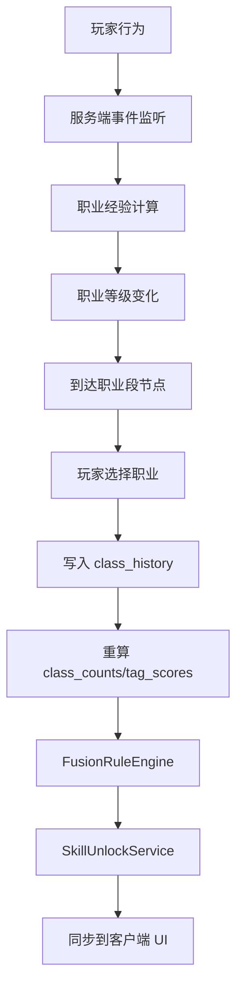
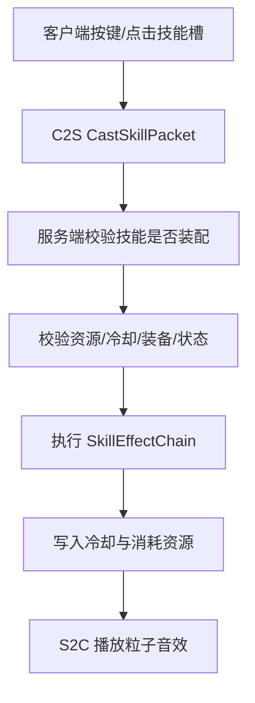

# MC Mod 开发落地文档：职业履历融合

文档版本：v0.1  
日期：2026-06-01  
对应产品文档：[职业履历融合MOD产品设计.md](/Users/hongyuwu/Documents/MC_MOD/职业履历融合MOD产品设计.md)  
推荐技术线：Minecraft 1.20.1 + Forge，后续再评估 NeoForge 1.21.x。

## 1. 开发目标

本开发文档把产品设计拆成可以落地的程序、美术、UI、实体、技能特效和数据方案。

首要目标不是一次性做完完整 RPG 系统，而是先实现一个可玩的纵切版本：

- 玩家首次进入世界选择种族。
- 玩家通过职业经验升级。
- 每 10 级选择一次职业段。
- 职业履历进入履历池。
- 融合技能按无序组合解锁。
- 技能可装配、可释放、可冷却、可同步。
- 至少验证 `火魔法师 + 弓箭手 = 火焰箭`，且顺序不影响最终结果。

核心验收句：

```text
火魔法师 -> 弓箭手
弓箭手 -> 火魔法师
```

两条路线在达到 `火魔法师 x1 + 弓箭手 x1` 后，都解锁同一个 `火焰箭`。

## 2. 总体技术架构

### 2.1 模块划分

| 模块 | 包建议 | 职责 |
|---|---|---|
| 核心入口 | `careerchronicle` | Mod 初始化、注册、配置加载 |
| 玩家数据 | `careerchronicle.player` | 种族、等级、履历、技能、冷却 |
| 数据定义 | `careerchronicle.data` | JSON 读取、数据校验、注册表 |
| 履历计算 | `careerchronicle.career` | 职业次数、标签强度、融合计算 |
| 技能运行时 | `careerchronicle.skill` | 技能释放、冷却、消耗、效果执行 |
| UI 菜单 | `careerchronicle.client.screen` | 种族、职业、技能装配界面 |
| 网络同步 | `careerchronicle.network` | C2S 输入、S2C 数据同步 |
| 实体 | `careerchronicle.entity` | 召唤物、训练用实体、隐藏职业实体 |
| 特效 | `careerchronicle.client.fx` | 粒子、音效、客户端表现 |
| 命令 | `careerchronicle.command` | 管理员命令、调试命令 |
| 配置 | `careerchronicle.config` | 服务器配置、客户端配置 |

### 2.2 服务端权威边界

必须在服务端计算：

- 职业经验增加。
- 职业等级变化。
- 职业段选择是否合法。
- 种族是否已选择。
- 履历池统计。
- 技能解锁与移除。
- 技能消耗、冷却、伤害、治疗、召唤。
- 隐藏职业解锁条件。

客户端只做：

- 界面显示。
- 玩家点击和按键输入。
- 本地粒子、音效、动画。
- 技能瞄准预览。

客户端发来的任何技能释放请求都必须重新校验。

### 2.3 数据流



技能释放数据流：



## 3. 玩家数据实现

### 3.1 Forge 1.20.1 推荐方式

0.1 固定使用 Forge Capability。不要同时实现 Capability 和另一套玩家持久化 NBT 包装层，否则会造成数据来源分叉。

落地路径：

- `AttachCapabilitiesEvent<Entity>`：当实体是 `Player` 时附加 `CareerDataProvider`。
- `PlayerEvent.Clone`：玩家死亡、末地返回或重建 Player 实例时复制职业数据。
- `PlayerLoggedInEvent`：登录后服务端向客户端同步职业快照。
- `PlayerChangedDimensionEvent`：跨维度后同步职业快照。
- `PlayerRespawnEvent`：重生后同步职业快照。
- `PlayerLoggedOutEvent`：清理短期战斗状态，例如普通技能冷却和下一发箭标记。

为了后续迁移 NeoForge，可以把业务接口封装成 `ICareerData`，但 0.1 的底层实现明确为 `CareerDataCapability`。客户端 UI 不直接读取服务端 Capability，只读取服务端同步来的 `CareerClientSnapshot`。

建议接口：

```java
public interface ICareerData {
    ResourceLocation getRaceId();
    int getCareerLevel();
    int getCareerXp();
    List<ClassSegment> getClassHistory();
    Set<ResourceLocation> getUnlockedSkills();
    SkillLoadout getSkillLoadout();
    Map<ResourceLocation, Boolean> getHiddenFlags();

    void setRaceId(ResourceLocation raceId);
    void addCareerXp(ServerPlayer player, int amount);
    boolean addClassSegment(ResourceLocation classId, int slot);
    void setSkillLoadout(SkillLoadout loadout);
    CompoundTag serializeNBT();
    void deserializeNBT(CompoundTag tag);
}
```

短期战斗状态不进入 `ICareerData`：

```java
public interface ICareerCombatState {
    Map<ResourceLocation, Long> getCooldowns();
    List<ProjectileModifier> getNextProjectileModifiers();
    ManaStaminaState getResources();
}
```

`ICareerCombatState` 可以挂在同一个 provider 中，但普通 3 到 60 秒冷却不持久化。隐藏职业仪式、长 CD 世界能力如果需要跨登录保留，应另建 `longCooldowns` 并使用绝对游戏时间或现实时间。

### 3.2 数据结构

玩家持久化 NBT 建议：

```text
careerchronicle:
  race: "careerchronicle:human"
  careerLevel: 12
  careerXp: 3400
  unspentClassSlots: [2]
  classHistory:
    - slot: 1
      rangeStart: 1
      rangeEnd: 10
      class: "careerchronicle:fire_mage"
  unlockedSkills:
    - "careerchronicle:fireball"
  loadout:
    active:
      - "careerchronicle:fireball"
      - ""
      - ""
      - ""
    passive:
      - ""
      - ""
      - ""
      - ""
    ultimate: ""
    race: "careerchronicle:human_adaptability"
  hiddenFlags:
    read_lich_tome: 0b
```

### 3.3 复制与死亡处理

必须处理：

- 玩家死亡后数据复制到新 Player 实例。
- 玩家从末地返回或跨维度时数据不丢。
- 玩家退出重进后技能冷却、装配、职业履历不丢。
- `event.isWasDeath()` 为 true 时仍复制职业履历、种族、等级、技能解锁。
- 非死亡 clone 时完整复制所有职业数据。

死亡规则建议：

- 职业数据默认不随死亡掉落或重置。
- 服务器可配置死亡是否损失少量职业经验。
- 隐藏职业进度不因死亡重置，除非是特殊仪式中断。
- 普通技能短冷却死亡后清空，避免玩家重生后 UI 和实际状态混乱。

## 4. 数据驱动设计

### 4.1 数据目录

建议使用数据包路径：

```text
data/careerchronicle/races/*.json
data/careerchronicle/classes/*.json
data/careerchronicle/skills/*.json
data/careerchronicle/fusions/*.json
data/careerchronicle/hidden_unlocks/*.json
data/careerchronicle/xp_sources/*.json
```

客户端资产路径：

```text
assets/careerchronicle/textures/gui/*.png
assets/careerchronicle/textures/skill/*.png
assets/careerchronicle/textures/entity/*.png
assets/careerchronicle/lang/zh_cn.json
assets/careerchronicle/lang/en_us.json
assets/careerchronicle/sounds.json
```

### 4.2 加载方式

Forge 1.20.1 使用数据包 reload listener 加载 JSON。可通过 `AddReloadListenerEvent` 注册 `SimpleJsonResourceReloadListener` 派生 loader。建议每类数据一个 loader：

- `RaceDataLoader`
- `ClassDataLoader`
- `SkillDataLoader`
- `FusionDataLoader`
- `HiddenUnlockDataLoader`
- `XpSourceDataLoader`

重载时做校验：

- ID 是否重复。
- 职业引用的技能是否存在。
- 融合规则引用的技能是否存在。
- 技能引用的 effect executor 是否存在。
- 隐藏职业引用的职业和条件是否存在。
- 图标路径是否存在可以只警告，不阻塞服务器启动。

线程和替换规则：

1. 解析阶段读取 JSON，生成临时对象。
2. 校验阶段在临时 registry 中检查引用关系。
3. 只有所有关键校验通过，才在 apply 阶段一次性替换运行时 immutable registry。
4. 如果 reload 失败，保留旧 registry，不让服务器进入半更新状态。
5. apply 完成后遍历在线玩家：
   - 重算履历池。
   - 移除已不存在或被禁用的技能装配。
   - 同步新的 `CareerClientSnapshot`。
6. 技能释放时只读取当前 immutable registry 引用，不直接读 loader 的中间状态。

运行时 registry 建议：

```java
public final class CareerRegistries {
    private volatile RegistrySnapshot snapshot;

    public RegistrySnapshot snapshot() {
        return snapshot;
    }

    public void replace(RegistrySnapshot newSnapshot) {
        this.snapshot = newSnapshot;
    }
}
```

### 4.3 数据定义示例

职业：

```json
{
  "id": "careerchronicle:fire_mage",
  "display": {
    "name_key": "class.careerchronicle.fire_mage",
    "description_key": "class.careerchronicle.fire_mage.desc",
    "icon": "careerchronicle:skill/fire_mage"
  },
  "tags": {
    "fire": 1,
    "spell": 1
  },
  "base_skills": [
    "careerchronicle:fireball"
  ],
  "repeat_rewards": {
    "2": ["careerchronicle:fire_burst"],
    "3": ["careerchronicle:burning_mastery"]
  },
  "requirements": []
}
```

融合：

```json
{
  "id": "careerchronicle:flame_arrow_fusion",
  "skill": "careerchronicle:flame_arrow",
  "conditions": {
    "tags": {
      "fire": 1,
      "bow": 1
    }
  },
  "priority": 100
}
```

技能：

```json
{
  "id": "careerchronicle:flame_arrow",
  "display": {
    "name_key": "skill.careerchronicle.flame_arrow",
    "description_key": "skill.careerchronicle.flame_arrow.desc",
    "icon": "careerchronicle:skill/flame_arrow"
  },
  "slot_type": "active",
  "cast_type": "next_projectile_modifier",
  "cooldown_ticks": 160,
  "cost": {
    "stamina": 12
  },
  "requirements": {
    "equipment_tags": ["minecraft:bows", "minecraft:crossbows"]
  },
  "effects": [
    {
      "type": "careerchronicle:mark_next_projectile",
      "modifier": "careerchronicle:flame_arrow_modifier",
      "duration_ticks": 100
    }
  ],
  "client_fx": {
    "cast_sound": "careerchronicle:skill.flame_arrow.cast",
    "trail_particle": "minecraft:flame"
  }
}
```

图标字段使用逻辑 ID，不在数据包里写完整 texture 路径。客户端约定把：

```text
careerchronicle:skill/flame_arrow
```

解析为：

```text
assets/careerchronicle/textures/gui/skill/flame_arrow.png
```

## 5. 履历池与融合算法

### 5.1 核心规则

职业融合只看履历池，不看职业选择顺序。

输入：

- 种族 ID。
- 职业履历列表。
- 已触发隐藏条件。
- 成就或统计。

输出：

- 职业次数 `class_counts`。
- 标签强度 `tag_scores`。
- 应解锁技能集合。
- 应显示但未满足的线索集合。

### 5.2 计算步骤

```text
1. 清空 class_counts 和 tag_scores。
2. 从种族读取基础 tag_bonus。
3. 遍历 class_history：
   3.1 class_counts[classId] += 1
   3.2 对该职业每个 tag 执行 tag_scores[tag] += value
4. 遍历职业 repeat_rewards：
   4.1 如果 class_counts[classId] >= requiredCount，则加入专精技能
5. 遍历 fusion rules：
   5.1 如果所有 conditions 满足，则加入融合技能
6. 遍历 hidden unlocks：
   6.1 如果条件满足，则加入可选隐藏职业或隐藏技能
7. 输出 unlocked_skills。
```

### 5.3 伪代码

```java
CareerSnapshot recalculate(ServerPlayer player, ICareerData data) {
    Map<ResourceLocation, Integer> classCounts = new HashMap<>();
    Map<String, Integer> tagScores = new HashMap<>();
    Set<ResourceLocation> skills = new HashSet<>();

    RaceDef race = raceRegistry.get(data.getRaceId());
    addTags(tagScores, race.tagBonus());
    skills.addAll(race.baseSkills());

    for (ClassSegment segment : data.getClassHistory()) {
        ClassDef classDef = classRegistry.get(segment.classId());
        classCounts.merge(segment.classId(), 1, Integer::sum);
        addTags(tagScores, classDef.tags());
        skills.addAll(classDef.baseSkills());
    }

    for (ClassDef classDef : classRegistry.values()) {
        int count = classCounts.getOrDefault(classDef.id(), 0);
        skills.addAll(classDef.repeatRewardsFor(count));
    }

    for (FusionDef fusion : fusionRegistry.values()) {
        if (fusion.conditions().matches(player, data, classCounts, tagScores)) {
            skills.add(fusion.skillId());
        }
    }

    return new CareerSnapshot(classCounts, tagScores, skills);
}
```

### 5.4 一致性测试用例

必须写测试或调试命令验证：

```text
Case A:
history = [fire_mage, archer]
expect unlocked contains flame_arrow

Case B:
history = [archer, fire_mage]
expect unlocked contains flame_arrow

Case C:
history = [fire_mage, fire_mage, archer]
expect unlocked contains flame_arrow
expect unlocked contains explosive_flame_arrow

Case D:
history = [fire_mage]
expect unlocked not contains flame_arrow
```

## 6. 等级与经验实现

### 6.1 职业等级曲线

MVP 建议等级上限 30。

经验曲线：

```text
xp_to_next(level) = 100 + level * 35 + floor(level^1.35 * 12)
```

目的：

- 1 到 10 级较快，让玩家尽快选第一个职业。
- 10 到 20 级有明显成长，但不拖。
- 20 到 30 级开始要求玩家探索更多内容。

### 6.2 职业经验来源

0.1 只做击杀经验。探索、制作和辅助经验延后到 0.2，避免在核心融合规则尚未验证前引入大量事件兼容问题。

0.2 后再扩展：

| 来源 | 实现事件 | 经验 |
|---|---|---|
| 击杀怪物 | LivingDeathEvent | 根据怪物最大生命和类型 |
| 探索结构 | Advancement/自定义触发器/结构定位缓存 | 一次性奖励 |
| 制作/炼药 | ItemCraftedEvent / Brewing 相关事件 | 少量奖励 |

不要用 `PlayerTickEvent` 每 tick 扫描结构。结构探索经验应通过成就、触发器、一次性记录或低频缓存实现。

### 6.3 防刷设计

MVP 最低限度：

- 同一召唤物击杀不提供经验。
- 玩家自己放置的训练实体不提供经验。
- 可配置刷怪笼怪物经验倍率。
- 怪物必须最近被玩家或玩家技能伤害过。

## 7. UI 实现设计

### 7.1 UI 总原则

UI 要解决两个问题：

- 玩家知道自己现在是什么构筑。
- 玩家知道下一次选择会得到什么。

不要把所有公式暴露给玩家。界面应该用“获得、解锁、可能路线”来解释。

0.1 UI 范围只保留：

- 首次种族选择 Screen。
- 职业选择 Screen。
- 简化 HUD：当前技能、冷却、法力/体力。

以下内容延后到 0.2：

- 职业主界面多标签页。
- 完整技能装配界面。
- 线索页。
- 职业手册。

### 7.2 种族选择界面

触发：

- 玩家首次进入世界。
- 管理员重置种族后。

布局：

```text
左侧：种族列表
中间：种族立绘/图标 + 简介
右侧：优势、弱点、推荐职业、隐藏路线线索
底部：确认按钮、返回/随机按钮
```

MVP 美术：

- 每个种族 64x64 图标。
- 不做完整立绘。
- 背景使用半透明深色面板。

交互：

- 鼠标悬停显示详细 tooltip。
- 确认前二次弹窗。
- 服务器禁止重选时，确认后不可修改。

### 7.3 职业选择界面

触发：

- 玩家达到 10/20/30 等职业段节点。
- 玩家主动打开职业界面且存在未选择职业段。

布局：

```text
顶部：当前等级、经验、职业段
左侧：职业履历时间轴
中间：可选职业卡片
右侧：选择预览
底部：确认按钮
```

职业卡片内容：

- 职业图标。
- 职业名。
- 标签小图标。
- 已选择次数。
- 是否可选。
- 不可选原因。

选择预览必须显示：

```text
选择：弓箭手
立即获得：
- 蓄力射击
- bow +1 / projectile +1 / precision +1

因此解锁：
- 火焰箭

未来可能路线：
- 爆裂火箭：需要 fire +2, bow +1
- 魔箭术士：需要完成元素箭试炼
```

### 7.4 职业主界面

0.2 开始实现。

默认按键建议：`K`。

页面：

- 总览。
- 履历。
- 技能。
- 线索。
- 配置只读页。

总览页：

```text
种族：精灵
等级：23
职业履历：火魔法师 x1 / 弓箭手 x1
构筑名：魔箭手
主要标签：fire 1, bow 1, spell 1, precision 1
```

构筑名可以由规则生成：

- `fire + bow`：魔箭手。
- `holy + melee`：圣战士。
- `dark + melee`：死亡骑士候补。

### 7.5 技能装配界面

0.2 开始实现完整界面。0.1 采用固定主动槽或命令装配：

```text
/career skill equip <slot> <skill>
```

布局：

```text
左侧：已解锁技能列表
中间：技能详情
右侧：主动槽 x4、被动槽 x4、终极槽 x1、种族槽 x1
```

0.2 初版可以先做：

- 主动槽 x4。
- 被动槽 x2。
- 种族槽 x1。

技能 tooltip：

- 类型。
- 冷却。
- 消耗。
- 装备需求。
- 当前数值。
- 来源：基础/专精/融合/种族/隐藏。

### 7.6 HUD

0.1 HUD：

- 法力条。
- 体力条。
- 技能槽冷却遮罩。
- 当前蓄力或下次箭矢附魔状态。

0.1 技能槽可以只显示固定 3 格：

- 火球。
- 蓄力射击。
- 火焰箭。

完整 4 格可配置技能槽延后到 0.2。

## 8. 美术规范

### 8.1 总体风格

美术目标：高识别度、低制作成本、Minecraft 风格兼容。

不建议首发追求复杂 3D 动画。优先使用：

- 16x16 或 32x32 技能图标。
- 64x64 种族图标。
- 原版粒子组合。
- 少量自定义粒子贴图。
- 简单 entity texture。
- 简洁音效。

### 8.2 图标规范

技能图标：

- 尺寸：32x32。
- 背景形状用于区分类型：
  - 圆形：主动技能。
  - 菱形：融合技能。
  - 六边形：隐藏技能。
  - 方形：被动技能。
- 色彩用于区分元素：
  - 火焰：红/橙。
  - 冰霜：蓝/青。
  - 神圣：白/金。
  - 黑暗：紫/黑。
  - 弓术：绿/棕。
  - 防御：灰/银。

种族图标：

- 尺寸：64x64。
- 要体现种族轮廓，不做过细写实。
- 首发避免完整大立绘，节省成本。

### 8.3 粒子规范

优先复用原版粒子：

| 元素 | 粒子 |
|---|---|
| 火焰 | `minecraft:flame`, `minecraft:small_flame`, `minecraft:lava` |
| 冰霜 | `minecraft:snowflake`, `minecraft:item_snowball` |
| 神圣 | `minecraft:end_rod`, `minecraft:happy_villager` |
| 黑暗 | `minecraft:smoke`, `minecraft:soul`, `minecraft:witch` |
| 治疗 | `minecraft:heart`, `minecraft:effect` |

自定义粒子首发只做 2 到 4 个：

- `flame_spark`
- `frost_shard`
- `holy_glyph`
- `dark_wisp`

### 8.4 音效规范

首发可以先用原版音效组合：

- 火焰：烈焰人、火焰弹、营火。
- 冰霜：玻璃、雪块、紫水晶。
- 神圣：经验球、钟声、信标。
- 黑暗：灵魂沙、凋灵、末影。

自定义音效留到 Beta。

## 9. 技能运行时设计

### 9.1 技能分类

| 类型 | 说明 | 示例 |
|---|---|---|
| instant | 点击立即生效 | 火球、治疗 |
| self_buff | 给自己状态 | 烈焰护体 |
| target_buff | 给目标状态 | 祝福 |
| projectile | 发射实体 | 火球术 |
| next_projectile_modifier | 修改下一发箭 | 火焰箭 |
| passive | 被动监听事件 | 点燃精通 |
| summon | 召唤实体 | 炎灵召唤 |
| ultimate | 终极技能 | 炎狱领域 |

### 9.2 效果执行器

技能 JSON 不直接写 Java 逻辑，而是引用固定 effect executor。

首发执行器：

| Executor | 用途 |
|---|---|
| `damage` | 造成伤害 |
| `spawn_projectile` | 发射技能弹体 |
| `mark_next_projectile` | 修改下一发箭 |
| `play_fx` | 通知客户端播放特效 |

0.1 只实现以上 4 个 executor。以下 executor 延后：

- `apply_mob_effect`
- `heal`
- `knockback`
- `area_effect`
- `summon_entity`
- `resource_change`

资源消耗和冷却在 `SkillRuntime` 统一处理，不需要在 0.1 做成通用 executor。

技能运行时按链式执行：

```text
校验 -> 消耗资源 -> 写冷却 -> 执行效果链 -> 同步表现
```

### 9.3 资源与冷却

资源：

- 法力：法术、治疗、召唤。
- 体力：近战、弓术、闪避。

冷却：

- 存储为 `skill_id -> ready_game_time`。
- 服务端校验当前 `level.getGameTime() >= readyTime`。
- 客户端只显示，不做最终判断。

### 9.4 技能输入

MVP 输入方案：

- `K` 打开职业界面。
- `R` 释放当前选中技能。
- `Alt + 1/2/3/4` 或独立键绑定选择技能槽。
- 鼠标滚轮切换技能槽可选。

服务器收到：

```text
C2SSelectSkillSlot(slot)
C2SCastSkill(skillSlot, targetInfo)
```

`targetInfo` 只作为客户端意图，服务端仍需 ray trace 校验。

## 10. 具体技能落地样例

### 10.1 火球 Fireball

来源：

- 火魔法师 x1 基础技能。

输入：

- 主动技能。

消耗：

- 法力 18。

冷却：

- 3 秒。

效果：

- 发射一个小型火球实体或自定义 projectile。
- 命中造成 `4 + spell_power * 0.6` 火焰伤害。
- 点燃目标 3 秒。
- 命中方块时产生小范围火焰粒子，不破坏方块。

技术实现：

- 0.1 可复用 SmallFireball 行为但调整伤害和不破坏地形。
- 更稳妥方式是自定义 `CareerProjectileEntity`，用 JSON 指定速度、重力、碰撞效果。

美术表现：

- 飞行轨迹：`flame` + `smoke`。
- 命中：`lava` + 小爆裂音效。
- 图标：橙红火球。

### 10.2 蓄力射击 Charged Shot

来源：

- 弓箭手 x1 基础技能。

输入：

- 主动技能。

消耗：

- 体力 10。

冷却：

- 5 秒。

效果：

- 标记下一发箭。
- 下一发箭额外增加伤害和飞行速度。
- 如果完全拉满弓，额外增加穿透 1。

技术实现：

- 写入玩家临时状态 `next_projectile_modifiers`。
- 监听 `EntityJoinLevelEvent`，当新实体是 `AbstractArrow` 且 owner 是 `ServerPlayer` 时，消费该玩家的 `next_projectile_modifiers`。
- 把 modifier 写入箭实体 `PersistentData`。
- 命中时通过 `ProjectileImpactEvent` 或伤害事件读取箭实体 `PersistentData`。
- 弩、多重射击、烟花弩需要单独测试；0.1 可先声明只完整支持弓和普通箭，弩支持进入 0.2。

美术表现：

- 拉弓时产生短暂白色线条粒子。
- 箭矢轨迹轻微 crit 粒子。

### 10.3 火焰箭 Flame Arrow

来源：

- 融合技能：`fire >= 1 && bow >= 1`。

输入：

- 主动技能。

消耗：

- 体力 12。

冷却：

- 8 秒。

效果：

- 标记下一发箭为火焰箭。
- 命中实体造成额外火焰伤害。
- 点燃目标 4 秒。
- 如果目标已燃烧，造成一次小额爆燃伤害。

技术实现：

- `mark_next_projectile` 给玩家写入 `careerchronicle:flame_arrow_modifier`。
- 监听 `EntityJoinLevelEvent`，识别 `AbstractArrow` 和 owner，把 modifier 写入箭实体 NBT。
- 监听箭命中：
  - 读取 modifier。
  - 服务端造成额外伤害。
  - 点燃目标。
  - 发送 S2C 粒子包。

美术表现：

- 释放时：玩家手部火星。
- 飞行时：箭尾 `small_flame`。
- 命中时：火花扩散。

关键测试：

```text
火魔法师 -> 弓箭手：能解锁火焰箭
弓箭手 -> 火魔法师：能解锁火焰箭
只选火魔法师：不能解锁火焰箭
只选弓箭手：不能解锁火焰箭
```

### 10.4 爆裂火箭 Explosive Flame Arrow

来源：

- 强化融合：`fire >= 2 && bow >= 1`。

消耗：

- 体力 16 + 法力 8。

冷却：

- 14 秒。

效果：

- 标记下一发箭。
- 命中后造成小范围火焰伤害。
- 不破坏方块。
- 点燃范围内目标。

技术实现：

- 使用 `area_effect`，范围 2.5 格。
- 使用自定义伤害类型，不调用原版爆炸破坏。
- 对玩家伤害倍率读取 PVP 配置。

美术表现：

- 飞行轨迹更亮。
- 命中时短促火焰环。

### 10.5 烈焰护体 Burning Guard

来源：

- 火魔法师 x3 或火魔法师 x2 + 守卫 x1。

消耗：

- 法力 25。

冷却：

- 25 秒。

效果：

- 8 秒内获得少量火焰抗性。
- 近战攻击自己的敌人被点燃。
- 不与原版 Fire Resistance 完全重叠，避免过强。

技术实现：

- 使用自定义 capability 状态或 MobEffect。
- 监听 LivingHurtEvent，如果攻击者近战且目标有状态，则点燃攻击者。

美术表现：

- 玩家周围低频火星。
- 不做大面积遮挡视野的火焰。

### 10.6 炎灵召唤 Ember Wisp

来源：

- `summon >= 1 && fire >= 1`，或隐藏路线。

消耗：

- 法力 35。

冷却：

- 45 秒。

效果：

- 召唤 1 个炎灵，持续 30 秒。
- 炎灵跟随玩家，攻击附近敌对生物。
- 最多同时存在 1 个，后续可通过专精提高到 2 个。

技术实现：

- 自定义 `EmberWispEntity`。
- 继承 PathfinderMob 或 FlyingMob。
- 目标选择只攻击敌对生物，不主动攻击玩家，PVP 由配置控制。
- 存储 owner UUID。
- owner 离线或死亡时消失。
- 每 20 tick 检查生命周期。

美术表现：

- 小型漂浮火焰实体。
- 16x16 或 32x32 简单贴图。
- 飞行时少量火焰粒子。

## 11. 生物实体设计

### 11.1 MVP 实体清单

0.1 只建议做 1 个实体：

| 实体 | 类型 | 用途 |
|---|---|---|
| CareerProjectileEntity | 技能投射物 | 火球、冰弹、暗影弹共用 |

`EmberWispEntity` 延后到 0.2。不要在 0.1 做大量 Boss、召唤物或职业导师。职业导师可以先用 UI 和物品手册替代。

### 11.2 CareerProjectileEntity

字段：

- owner UUID。
- skill ID。
- damage。
- element。
- life ticks。
- gravity。
- hit effect list。

行为：

- 飞行超过生命周期自动消失。
- 命中实体执行 hit effect。
- 命中方块执行 block hit effect。
- 不破坏方块，除非技能明确允许。

用途：

- 火球。
- 冰弹。
- 暗影弹。
- 神圣光弹。

### 11.3 EmberWispEntity

0.2 开始实现。不要放入 0.1。

属性：

- 生命：8。
- 移速：0.25。
- 攻击距离：8。
- 攻击间隔：30 tick。
- 持续时间：600 tick。

AI：

- FollowOwnerGoal。
- RangedAttackGoal。
- FloatGoal。
- LookAtPlayerGoal。
- OwnerHurtByTargetGoal。
- OwnerHurtTargetGoal。

限制：

- 同一玩家最多 1 个。
- 不加载区块追踪玩家过远位置。
- 距离 owner 超过 32 格传送到 owner 附近。
- owner 死亡、离线或维度不同则消失。
- 目标搜索不要每 tick 执行；使用目标选择 Goal 的默认间隔或自定义低频扫描。
- 每玩家召唤物上限必须在服务端配置中可调。

### 11.4 后续实体

Alpha/Beta 可考虑：

- FrostShardProjectile：可直接复用 CareerProjectileEntity。
- HolyGlyphEntity：地面持续治疗/伤害区域。
- LichPhylacteryBlockEntity：巫妖隐藏职业仪式。
- TrialDummyEntity：调试用训练假人。
- HiddenTrialGuardian：隐藏职业试炼守卫。

## 12. 技能特效落地方案

### 12.1 特效分层

每个技能特效分三层：

1. 施放提示：告诉玩家技能开始。
2. 轨迹提示：告诉玩家技能路径或状态。
3. 命中反馈：告诉玩家技能生效。

例如火焰箭：

- 施放提示：手部火星 + 短音效。
- 轨迹提示：箭尾火焰粒子。
- 命中反馈：火花爆开 + 点燃音效。

### 12.2 客户端表现包

服务端执行技能后发送：

```text
S2CPlaySkillFxPacket
- skillId
- fxType
- origin position
- target position optional
- entityId optional
- color optional
```

客户端收到后只播放表现，不改变游戏状态。

发送范围：

- 普通技能 FX 只发给 32 格内可见玩家。
- 大范围技能可配置为 48 或 64 格，但 0.1 不做大范围技能。
- 持续粒子尽量由客户端根据实体状态本地播放，不要服务端每 tick 发包。

### 12.3 粒子预算

为了服务器和低配客户端：

- 普通技能每次粒子不超过 30 个。
- 持续状态每 10 tick 播放一次少量粒子。
- 召唤物粒子每 5 到 10 tick 播放。
- 大范围终极技能允许 80 到 150 个粒子，但冷却长。
- 客户端配置可降低粒子密度。
- 粒子预算按“每次技能 + 可见玩家数量”共同考虑，不只按单次技能粒子数考虑。

### 12.4 颜色与形状语言

| 类型 | 颜色 | 形状 |
|---|---|---|
| 火焰 | 红/橙 | 火星、短尾迹、爆开 |
| 冰霜 | 蓝/白 | 碎片、六角、冻结环 |
| 神圣 | 白/金 | 光点、圆环、符文 |
| 黑暗 | 紫/黑 | 烟雾、涡旋、残影 |
| 弓术 | 绿/白 | 细线、准星、轨迹 |

## 13. 0.1 原型内容设计

### 13.1 种族

0.1 只做 2 个：

| 种族 | 被动 | 作用 |
|---|---|---|
| 人类 | 职业经验 +5% | 万能基线 |
| 精灵 | 弓术技能体力消耗 -10% | 验证远程倾向 |

魔裔延后到 0.2。

### 13.2 职业

0.1 只做 2 个：

| 职业 | 标签 | 技能 |
|---|---|---|
| 火魔法师 | fire +1, spell +1 | 火球 |
| 弓箭手 | bow +1, projectile +1, precision +1 | 蓄力射击 |

战士和牧师延后到 0.2。

### 13.3 融合技能

0.1 只做 1 个：

| 条件 | 技能 |
|---|---|
| fire >= 1 + bow >= 1 | 火焰箭 |

爆裂火箭、圣裁斩、净焰、祝福箭、烈焰斩延后到 0.2。

### 13.4 专精技能

0.1 每个职业 1 个重复奖励：

| 条件 | 技能 |
|---|---|
| 火魔法师 x2 | 火焰爆裂 |
| 弓箭手 x2 | 穿透射击 |

### 13.5 隐藏职业

隐藏职业延后到 0.2。0.1 不做隐藏职业，避免在履历融合还未验证前引入成就统计、怪物分类和额外 UI 线索。

隐藏职业：审判者

条件：

- 牧师 x1。
- 战士 x1。
- 击杀 20 个亡灵类怪物。
- 等级达到 20。

解锁方式：

- 满足条件后，在职业选择界面显示“审判者”。
- 下一个职业段可选择审判者。

技能：

- 审判打击：近战附加神圣伤害，对亡灵额外增强。

以上“审判者”作为 0.2 设计草案保留，不进入 0.1 开发范围。

## 14. 程序任务拆分

### 14.1 里程碑 0：工程骨架

- 创建 Forge 1.20.1 Mod 工程。
- 设置 modid：`careerchronicle`。
- 注册配置、网络、命令、事件总线。
- 加入基础语言文件。

验收：

- 游戏能启动。
- `/career debug` 命令存在。
- 服务端能加载 Mod。

### 14.2 里程碑 1：玩家数据

- 实现 `ICareerData`。
- 实现玩家数据持久化。
- 处理 clone/copy。
- 实现同步包。

验收：

- `/career race set` 后退出重进不丢。
- `/career xp add` 后等级正确。
- 死亡后数据不丢。

### 14.3 里程碑 2：数据加载

- 实现 races/classes/skills/fusions loader。
- 启动时加载默认数据。
- `/career reload` 重载。
- 数据校验和错误日志。

验收：

- 修改 JSON 后 reload 生效。
- 融合规则引用不存在技能时输出明确错误。

### 14.4 里程碑 3：职业段与履历池

- 实现等级曲线。
- 实现职业段节点。
- 实现职业选择命令。
- 实现履历池统计。
- 实现融合技能解锁。

验收：

- fire_mage + archer 和 archer + fire_mage 都解锁 flame_arrow。
- fire_mage + fire_mage 解锁 fire_burst。

### 14.5 里程碑 4：技能运行时

- 实现主动技能槽。
- 实现技能冷却。
- 实现法力/体力。
- 实现 4 个基础 effect executor：`spawn_projectile`、`mark_next_projectile`、`damage`、`play_fx`。
- 实现火球、蓄力射击、火焰箭。

验收：

- 技能不能绕过冷却。
- 没资源不能释放。
- 火焰箭只修改下一发箭。
- 服务端日志无异常。

### 14.6 里程碑 5：UI

- 种族选择界面。
- 职业选择界面。
- 简化 HUD 技能槽。
- 0.1 技能装配使用固定槽或命令，不做完整装配界面。

验收：

- 新玩家能选择种族。
- 到 10 级能选择职业。
- 选择职业时能预览新解锁融合。
- 技能槽冷却显示正确。

### 14.7 里程碑 6：实体与特效

- CareerProjectileEntity。
- S2C 特效包。
- 火焰基础粒子表现。

验收：

- 火球投射物命中正确。
- 粒子不会刷屏。

## 15. 数据示例：0.1 最小包

### 15.1 火魔法师

```json
{
  "id": "careerchronicle:fire_mage",
  "display": {
    "name_key": "class.careerchronicle.fire_mage",
    "description_key": "class.careerchronicle.fire_mage.desc",
    "icon": "careerchronicle:skill/fire_mage"
  },
  "tags": {
    "fire": 1,
    "spell": 1
  },
  "base_skills": ["careerchronicle:fireball"],
  "repeat_rewards": {
    "2": ["careerchronicle:fire_burst"]
  },
  "requirements": []
}
```

### 15.2 弓箭手

```json
{
  "id": "careerchronicle:archer",
  "display": {
    "name_key": "class.careerchronicle.archer",
    "description_key": "class.careerchronicle.archer.desc",
    "icon": "careerchronicle:skill/archer"
  },
  "tags": {
    "bow": 1,
    "projectile": 1,
    "precision": 1
  },
  "base_skills": ["careerchronicle:charged_shot"],
  "repeat_rewards": {
    "2": ["careerchronicle:piercing_shot"]
  },
  "requirements": []
}
```

### 15.3 火焰箭融合

```json
{
  "id": "careerchronicle:flame_arrow_fusion",
  "skill": "careerchronicle:flame_arrow",
  "conditions": {
    "tags": {
      "fire": 1,
      "bow": 1
    }
  },
  "priority": 100
}
```

### 15.4 火焰箭技能

```json
{
  "id": "careerchronicle:flame_arrow",
  "display": {
    "name_key": "skill.careerchronicle.flame_arrow",
    "description_key": "skill.careerchronicle.flame_arrow.desc",
    "icon": "careerchronicle:skill/flame_arrow"
  },
  "slot_type": "active",
  "cast_type": "next_projectile_modifier",
  "cooldown_ticks": 160,
  "cost": {
    "stamina": 12
  },
  "requirements": {
    "equipment_tags": ["minecraft:bows", "minecraft:crossbows"]
  },
  "effects": [
    {
      "type": "careerchronicle:mark_next_projectile",
      "modifier": "careerchronicle:flame_arrow_modifier",
      "duration_ticks": 100
    }
  ],
  "client_fx": {
    "cast_sound": "careerchronicle:skill.flame_arrow.cast",
    "trail_particle": "minecraft:flame"
  }
}
```

## 16. 测试与验收

### 16.1 必测用例

| 用例 | 步骤 | 预期 |
|---|---|---|
| 种族持久化 | 选择精灵，退出重进 | 仍是精灵 |
| 职业履历持久化 | 选择火魔法师，退出重进 | 履历保留 |
| 无序融合 A | 火魔法师 -> 弓箭手 | 解锁火焰箭 |
| 无序融合 B | 弓箭手 -> 火魔法师 | 解锁火焰箭 |
| 专精 | 火魔法师 -> 火魔法师 | 解锁火焰爆裂 |
| 不满足融合 | 只选择火魔法师 | 不解锁火焰箭 |
| 冷却 | 连续释放火球 | 第二次被拒绝 |
| 资源 | 法力不足释放火球 | 被拒绝 |
| 死亡复制 | 选择职业后死亡 | 数据保留 |
| 服务器重启 | 选择职业后重启 | 数据保留 |
| 弓箭标记 | 释放火焰箭后射出普通箭 | 箭实体带 flame_arrow modifier |
| 标记消费 | 火焰箭只影响下一发箭 | 第二发箭不带 modifier |

### 16.2 性能测试

MVP 至少测试：

- 10 名假玩家或真实玩家持续释放火球和火焰箭。
- 连续 10 分钟无明显 TPS 下降。
- 粒子低配模式有效。
- FX 包只发送给配置半径内玩家。

### 16.3 数据包测试

- 添加一个新融合规则后 reload。
- 禁用一个技能后玩家装配自动失效。
- 错误 JSON 能输出定位明确的日志。

## 17. 风险与落地取舍

### 17.1 主要风险

| 风险 | 影响 | 处理 |
|---|---|---|
| Capability 和同步 bug | 丢数据或显示错乱 | 先做命令和日志验证，再做 UI |
| 技能执行器过度通用 | 开发拖慢 | 0.1 只做 4 个 executor，0.2 再扩展 |
| UI 太复杂 | 工期失控 | 先做文字清楚的简化 UI |
| 粒子太多 | 客户端卡顿 | 粒子预算和客户端倍率 |
| 召唤物 AI 卡 TPS | 服务器不稳定 | 限数量、限搜索频率、限生命周期 |
| 数据包自由度太高 | 校验困难 | 先限制 JSON schema，再逐步开放 |

### 17.2 明确不做

0.1 不做：

- 大型 Boss。
- 完整职业剧情。
- 多页面百科。
- 自定义维度。
- 复杂 3D 技能动画。
- 每个职业专属模型。
- 100 级终局内容。
- 召唤物 AI。
- 隐藏职业。
- 完整技能装配 UI。
- 结构探索经验。
- 治疗、范围、召唤、buff 通用 executor。
- 弩、多重射击和烟花弩的完整兼容。

## 18. 给团队的开发顺序建议

最稳妥顺序：

1. 工程骨架。
2. 玩家数据和命令。
3. 数据加载。
4. 履历池和融合计算。
5. 调试命令验证无序融合。
6. 技能运行时。
7. 三个核心技能：火球、蓄力射击、火焰箭。
8. 简化 UI。
9. 粒子音效。
10. 召唤物和隐藏职业。

不要先做美术大图、Boss、复杂世界观。它们不会验证核心玩法。

0.1 的真正截止线：

- Capability 数据能保存和同步。
- JSON registry 能 reload 且失败不污染旧数据。
- 两个职业的无序融合能通过命令和 UI 验证。
- 火球、蓄力射击、火焰箭能释放。
- 火焰箭通过 `EntityJoinLevelEvent` 给下一发普通箭打标，并在命中时结算。

其他内容一律进入 0.2。

## 19. 首版美术资产清单

### 19.1 图标

种族图标：

- human.png
- elf.png
- demonkin.png，0.2

职业图标：

- fire_mage.png
- archer.png
- warrior.png，0.2
- priest.png，0.2

技能图标：

- fireball.png
- charged_shot.png
- flame_arrow.png
- explosive_flame_arrow.png，0.2
- power_slash.png，0.2
- minor_heal.png，0.2
- holy_smite.png，0.2
- cleansing_flame.png，0.2
- blessed_arrow.png，0.2
- flame_slash.png，0.2
- fire_burst.png
- piercing_shot.png

### 19.2 实体贴图

- career_projectile_fire.png
- ember_wisp.png，0.2

### 19.3 GUI

- career_panel.png
- skill_slot.png
- skill_slot_selected.png
- cooldown_overlay.png
- race_card.png
- class_card.png

## 20. 交付物清单

0.1 原型完成时至少应有：

- 可运行 Mod jar。
- 默认数据包 JSON。
- 中文语言文件。
- 基础技能图标。
- 种族选择界面。
- 职业选择界面。
- 简化 HUD。
- 固定技能槽或命令式技能装配。
- 管理员命令。
- 测试用例记录。
- 服务端配置说明。

## 21. SubAgent 专业审计采纳记录

本开发文档已经过一次专业 MC Mod 开发视角的 SubAgent 审计。审计结论是：方向可行，但原 0.1 范围过大，且 Forge 1.20.1 关键实现边界需要写硬。已采纳以下修改：

| 审计问题 | 采纳结果 |
|---|---|
| 玩家持久化数据方案过于模糊 | 0.1 固定 Forge Capability，明确 attach/clone/login/dimension/respawn 同步路径 |
| reload 缺少线程边界 | 增加临时 immutable registry、校验后原子替换、失败保留旧数据 |
| 下一发箭事件方案不准确 | 改为 `EntityJoinLevelEvent` 标记 `AbstractArrow`，命中阶段读取 modifier |
| 0.1 MVP 过重 | 收缩到 2 种族、2 职业、3 核心技能、1 融合技能 |
| executor 抽象过度 | 0.1 只保留 4 个 executor |
| UI 范围过大 | 0.1 只做种族选择、职业选择、简化 HUD |
| 召唤物 AI 不适合 0.1 | `EmberWispEntity` 延后到 0.2 |
| 粒子预算未按可见玩家计算 | 增加 FX 包半径限制和客户端本地持续粒子原则 |
| 结构探索不应 PlayerTick 扫描 | 0.1 只做击杀经验，探索经验延后 |
| 短冷却不应持久化 | 普通冷却改为短期战斗状态，下线清空 |
| icon 字段路径不规范 | 改为逻辑 ID，例如 `careerchronicle:skill/flame_arrow` |

## 22. 后续专业审计关注点

请 MC Mod 开发审计者重点检查：

1. Forge 1.20.1 下玩家持久化数据方案是否稳妥。
2. 数据包加载路径和 reload 机制是否可落地。
3. Arrow/Projectile 相关事件是否足以实现“修改下一发箭”。
4. 技能运行时是否会造成服务端安全问题。
5. 召唤物 AI 和粒子预算是否会影响 TPS。
6. UI 范围是否过大。
7. 0.1 里程碑是否仍然过重。
8. 哪些内容必须从 0.1 延后到 0.2。
